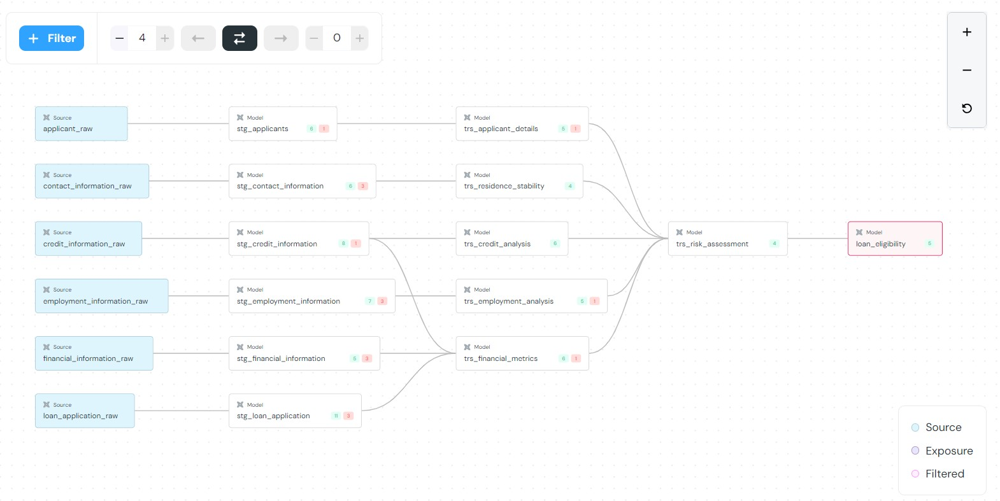

# **Loan Eligibility Data Pipeline Project**

Welcome to the **Loan Eligibility Data Pipeline** project! This project aims to build a data pipeline that processes loan application data to determine loan eligibility based on various financial and credit metrics. This guide provides comprehensive instructions to set up and run the project, including data generation, transformation, testing, and analysis using **dbt (Data Build Tool)** with **PostgreSQL**.

**Data Flow**:
    

---

## **Table of Contents**

1. [Project Overview](#project-overview)
2. [Prerequisites](#prerequisites)
3. [Environment Setup](#environment-setup)
   - [Create a Virtual Environment](#create-a-virtual-environment)
   - [Activate the Virtual Environment](#activate-the-virtual-environment)
   - [Install dbt and Dependencies](#install-dbt-and-dependencies)
4. [Database Setup](#database-setup)
   - [Initialize PostgreSQL Database](#initialize-postgresql-database)
   - [Create Database and Schemas](#create-database-and-schemas)
   - [Create Raw Tables](#create-raw-tables)
5. [Data Generation and Loading](#data-generation-and-loading)
6. [dbt Project Initialization](#dbt-project-initialization)
   - [Create a New dbt Project](#create-a-new-dbt-project)
   - [Configure dbt Profile](#configure-dbt-profile)
7. [dbt Models and Directory Structure](#dbt-models-and-directory-structure)
   - [Project Directory Structure](#project-directory-structure)
   - [Create Staging Models](#create-staging-models)
   - [Create Transformation Models](#create-transformation-models)
   - [Create Mart Models](#create-mart-models)
8. [dbt Tests and Macros](#dbt-tests-and-macros)
   - [Schema Testing with `schema.yml`](#schema-testing-with-schemayml)
   - [Custom Macros](#custom-macros)
9. [Running dbt Commands](#running-dbt-commands)
   - [dbt Compile](#dbt-compile)
   - [dbt Run](#dbt-run)
   - [dbt Test](#dbt-test)
   - [dbt Docs](#dbt-docs)
10. [Project Flow Explanation](#project-flow-explanation)
    - [Data Flow](#data-flow)
    - [Model Details](#model-details)
11. [Setting Up Elementary for Data Quality Checks](#setting-up-elementary-for-data-quality-checks)
12. [Conclusion](#conclusion)
13. [Appendix](#appendix)
    - [Common Issues and Solutions](#common-issues-and-solutions)
    - [References](#references)

---

## **Project Overview**

This project builds a data pipeline to assess loan eligibility for applicants based on their financial and credit information. The pipeline involves:

- **Data Generation**: Simulating raw data for loan applicants.
- **Data Loading**: Ingesting raw data into PostgreSQL.
- **Data Transformation**: Using dbt to transform and model data.
- **Data Testing**: Implementing tests to ensure data quality.
- **Data Analysis**: Generating insights on loan eligibility.

---

## **Prerequisites**

- **Python** (version 3.7 or higher)
- **PostgreSQL** (version 10 or higher)
- **dbt-core** (compatible with your Python version)
- **psycopg2** (for PostgreSQL connection)
- **Faker** library (for data generation)
- **Git** (optional, for version control)

---

## **Environment Setup**

### **Create a Virtual Environment**

It's recommended to use a virtual environment to manage project dependencies.

```bash
# Navigate to your project directory
cd path/to/your/project

# Create a virtual environment named 'dbt_venv'
python -m venv dbt_venv
```

### **Activate the Virtual Environment**

```bash
# On Windows
dbt_venv\Scripts\activate

# On Unix or MacOS
source dbt_venv/bin/activate
```

### **Install dbt and Dependencies**

```bash
# Upgrade pip
pip install --upgrade pip

# Install dbt-core and dbt-postgres
pip install dbt-core dbt-postgres

# Install other required packages
pip install psycopg2 faker setuptools
```

---

## **Database Setup**

### **Initialize PostgreSQL Database**

Ensure PostgreSQL is installed and running on your local machine.

### **Create Database and Schemas**

1. **Access PostgreSQL CLI or use a GUI tool (e.g., pgAdmin).**

```bash
# Access psql CLI
psql -U postgres
```

2. **Create a new database and user (if needed).**

```sql
-- Create a new database
CREATE DATABASE loan_database;

-- Create a new user with a password
CREATE USER loan_user WITH PASSWORD 'your_password';

-- Grant privileges
GRANT ALL PRIVILEGES ON DATABASE loan_database TO loan_user;
```

3. **Connect to the new database.**

```sql
\c loan_database
```

4. **Create Schemas**

```sql
-- Create 'raw' and 'transformed' schemas
CREATE SCHEMA raw;
CREATE SCHEMA transformed;
```

### **Create Raw Tables**

The SQL scripts to create the raw tables are located in the `table_ddls` folder in the root directory of the project. Execute these scripts to create the tables in the `raw` schema.

**Example:**

```sql
-- Content of table_ddls/applicant_raw.sql

CREATE TABLE raw.applicant_raw (
    applicant_id SERIAL PRIMARY KEY,
    first_name VARCHAR(50),
    last_name VARCHAR(50),
    date_of_birth DATE,
    gender VARCHAR(10),
    marital_status VARCHAR(20),
    number_of_dependents INTEGER
);
```

*Repeat similar steps to create other raw tables:*

- `raw.contact_information_raw`
- `raw.credit_information_raw`
- `raw.employment_information_raw`
- `raw.financial_information_raw`
- `raw.loan_application_raw`

---

## **Data Generation and Loading**

Data generation and loading are handled by Python scripts located in the `data-generator-loader` folder.

1. **Navigate to the data generator directory.**

```bash
cd data-generator-loader
```

2. **Install required Python packages (if not already installed).**

```bash
pip install faker psycopg2
# Install any other required packages as needed
```

3. **Run the data generation and loading scripts.**

```bash
python data_generator.py
python data_loader.py
```

*These scripts will:*

- Generate synthetic data for each raw table using the **Faker** library.
- Connect to the PostgreSQL database using **psycopg2**.
- Load the data into the corresponding tables in the `raw` schema.

---

## **dbt Project Initialization**

### **Create a New dbt Project**

1. **Navigate back to your project root directory.**

```bash
cd ..
```

2. **Initialize a new dbt project.**

```bash
dbt init loan_eligibility_project
```

3. **Navigate to the project directory.**

```bash
cd loan_eligibility_project
```

### **Configure dbt Profile**

Edit the `profiles.yml` file to connect dbt to your PostgreSQL database.

**Location:**

- On Unix/MacOS: `~/.dbt/profiles.yml`
- On Windows: `%USERPROFILE%\.dbt\profiles.yml`

**Example Configuration:**

```yaml
loan_eligibility_project:
  target: dev
  outputs:
    dev:
      type: postgres
      host: localhost
      user: loan_user
      password: your_password
      port: 5432
      dbname: loan_database
      schema: transformed  # Default schema for models
      threads: 4
```

---

## **dbt Models and Directory Structure**

### **Project Directory Structure**

```
loan_eligibility_project/
├── dbt_project.yml
├── models/
│   ├── staging/
│   │   ├── stg_applicants.sql
│   │   ├── stg_contact_information.sql
│   │   ├── stg_credit_information.sql
│   │   ├── stg_employment_information.sql
│   │   ├── stg_financial_information.sql
│   │   ├── stg_loan_application.sql
│   │   └── schema.yml
│   ├── transformed/
│   │   ├── trs_applicant_details.sql
│   │   ├── trs_credit_analysis.sql
│   │   ├── trs_employment_analysis.sql
│   │   ├── trs_financial_metrics.sql
│   │   ├── trs_residence_stability.sql
│   │   ├── trs_risk_assessment.sql
│   │   └── schema.yml
│   └── mart/
│       ├── loan_eligibility.sql
│       └── schema.yml
├── macros/
│   ├── test_macros.sql
├── tests/
├── seeds/
└── snapshots/
```

### **Create Staging Models**

Staging models are responsible for cleaning and deduplicating raw data. All the staging models are located inside the `models/staging` directory. You can modify these models as needed or utilize them as per your business logic.

**Example:**

- `stg_applicants.sql`
- `stg_contact_information.sql`
- `stg_credit_information.sql`

Ensure that each staging model selects data from the corresponding raw table and applies any necessary data cleaning or deduplication logic.

**Create `models/staging/schema.yml`**

Define tests and documentation for staging models in the `schema.yml` file.

```yaml
version: 2

models:
  - name: stg_applicants
    description: "Staging model for applicants."
    columns:
      - name: applicant_id
        tests:
          - not_null
          - unique
      - name: email_address
        tests:
          - not_null
          - regex:
              pattern: '^[a-z0-9]+[\._]?[a-z0-9]+[@]\w+[.]\w+$'
```

*Add tests for other columns and models as needed, including regex checks for email and phone numbers.*

### **Create Transformation Models**

Transformation models aggregate and calculate metrics required for loan eligibility. All transformation models are located inside the `models/transformed` directory. You can modify these models as needed or utilize them as per your business logic.

**Example:**

- `trs_applicant_details.sql`
- `trs_credit_analysis.sql`
- `trs_financial_metrics.sql`

**Create `models/transformed/schema.yml`**

Define tests and documentation for transformed models.

```yaml
version: 2

models:
  - name: trs_financial_metrics
    description: "Financial metrics for applicants."
    columns:
      - name: applicant_id
        tests:
          - not_null
          - unique
          - relationships:
              to: ref('trs_applicant_details')
              field: applicant_id
      - name: dti_ratio
        tests:
          - accepted_range:
              min_value: 0
              max_value: 5
```

### **Create Mart Models**

Mart models are final models used for reporting and analysis. The final transformation model is located inside the `models/mart` directory. You can modify this model as needed or utilize it as per your business logic.

**Example:**

- `loan_eligibility.sql`

**Create `models/mart/schema.yml`**

Define tests and documentation for mart models.

```yaml
version: 2

models:
  - name: loan_eligibility
    description: "Final loan eligibility decisions for applicants."
    columns:
      - name: applicant_id
        tests:
          - not_null
          - unique
      - name: loan_decision
        tests:
          - accepted_values:
              values: ['Approved', 'Review: Manual Approval Required', 'Declined']
      - name: offered_interest_rate
        tests:
          - accepted_range:
              min_value: 0.09
              max_value: 0.12
```

---

## **dbt Tests and Macros**

### **Schema Testing with `schema.yml`**

Define tests for each model's columns using the `schema.yml` files. Use built-in dbt tests such as `not_null`, `unique`, `accepted_values`, `accepted_range`, and regex patterns for email and phone number validation.

**Example:**

```yaml
columns:
  - name: credit_score
    tests:
      - not_null
      - accepted_range:
          min_value: 300
          max_value: 850
  - name: email_address
    tests:
      - not_null
      - regex:
          pattern: '^[a-z0-9]+[\._]?[a-z0-9]+[@]\w+[.]\w+$'
```

### **Custom Macros**

Create custom macros for complex tests and place them in the `macros` directory. These macros can be referenced in your `schema.yml` files.

**Example:**

- `macros/test_credit_utilization_accuracy.sql`
- `macros/test_dti_ratio_accuracy.sql`

**Usage in `schema.yml`:**

```yaml
models:
  - name: trs_financial_metrics
    tests:
      - dti_ratio_accuracy
```

---

## **Running dbt Commands**

### **dbt Compile**

Compile the project to ensure models are valid.

```bash
dbt compile
```

### **dbt Run**

Run models to build views/tables in the database.

```bash
dbt run
```

### **dbt Test**

Run tests defined in `schema.yml` files.

```bash
dbt test
```

### **dbt Docs**

Generate and serve documentation.

```bash
dbt docs generate
dbt docs serve
```

---

## **Project Flow Explanation**

### **Data Flow**

1. **Data Generation and Loading:**

   - Synthetic data is generated and loaded into the `raw` schema's tables.

2. **Staging Models:**

   - **Purpose:** Clean and deduplicate raw data.
   - **Location:** `models/staging/`
   - **Materialization:** Models are materialized as views in the `transformed` schema.

3. **Transformation Models:**

   - **Purpose:** Aggregate and calculate necessary metrics.
   - **Location:** `models/transformed/`
   - **Materialization:** Models are materialized as views in the `transformed` schema.

4. **Mart Models:**

   - **Purpose:** Final models used for reporting and decision-making.
   - **Location:** `models/mart/`
   - **Materialization:** Models are materialized as views in the `transformed` schema.

### **Model Details**

- **Staging Models:**

  - `stg_applicants`: Cleans applicant data.
  - `stg_contact_information`: Cleans contact data.
  - `stg_credit_information`: Cleans credit data.
  - `stg_employment_information`: Cleans employment data.
  - `stg_financial_information`: Cleans financial data.
  - `stg_loan_application`: Cleans loan application data.

- **Transformation Models:**

  - `trs_applicant_details`: Calculates age of applicants.
  - `trs_credit_analysis`: Calculates credit utilization ratio.
  - `trs_employment_analysis`: Determines employment stability.
  - `trs_financial_metrics`: Calculates Debt-to-Income (DTI) and Loan-to-Income (LTI) ratios.
  - `trs_residence_stability`: Calculates residence stability.
  - `trs_risk_assessment`: Assigns risk tiers based on metrics.

- **Mart Models:**

  - `loan_eligibility`: Determines loan eligibility and decisions.

---

## **Setting Up Elementary for Data Quality Checks**

Elementary is a data monitoring tool that helps in tracking data quality and anomalies. Follow the steps below to set up Elementary in your dbt project.

### **1. Add Elementary Package**

Create a `packages.yml` file in the root of your dbt project and add the following content:

```yaml
packages:
  - package: elementary-data/elementary
    version: 0.16.1
```

Update the `dbt_project.yml` file to set a schema for Elementary models:

```yaml
models:
  elementary:
    +schema: "elementary"
```

### **2. Install Elementary and Run Models**

Install dependencies:

```bash
dbt deps
```

Run the Elementary models:

```bash
dbt run --select elementary
```

Generate the Elementary CLI profile:

```bash
dbt run-operation elementary.generate_elementary_cli_profile
```

Add the generated CLI profile to your `~/.dbt/profiles.yml` file.

Install the Elementary Data library for generating reports:

```bash
pip install elementary-data[postgres]
```

Verify the installation:

```bash
edr --version
```

### **3. Running dbt Models and Generating Elementary Reports**

Create your dbt models in the `models/` directory and run them:

```bash
dbt run
dbt test
```

Generate an Elementary report:

```bash
edr report
```

*This report provides insights into data quality, including anomalies, freshness, and test results.*

---

## **Conclusion**

This project demonstrates how to build a robust data pipeline using **dbt** and **PostgreSQL** to assess loan eligibility based on various financial and credit metrics. By following the steps outlined, you can set up the environment, generate and load data, create models, run tests, and generate documentation and data quality reports.

---

## **Appendix**

### **Common Issues and Solutions**

- **Database Connection Errors:**
  - Ensure PostgreSQL is running.
  - Verify connection details in `profiles.yml`.
  - Check network configurations and firewall settings.

- **dbt Compilation Errors:**
  - Check SQL syntax in models.
  - Ensure macros and tests are correctly defined.
  - Verify that all referenced models and sources exist.

- **Test Failures:**
  - Investigate data quality issues.
  - Validate logic in custom macros.
  - Ensure that data meets the defined acceptance criteria.

- **Elementary Setup Issues:**
  - Confirm that the Elementary package version is compatible.
  - Verify the installation of the Elementary Data library.
  - Check the configuration in `dbt_project.yml` and `profiles.yml`.

### **References**

- [dbt Documentation](https://docs.getdbt.com/)
- [PostgreSQL Documentation](https://www.postgresql.org/docs/)
- [Python Virtual Environments](https://docs.python.org/3/tutorial/venv.html)
- [Elementary Data Documentation](https://docs.elementary-data.com/)

---

**Thank you for using the Loan Eligibility Data Pipeline project! If you have any questions or need further assistance, feel free to reach out.**
